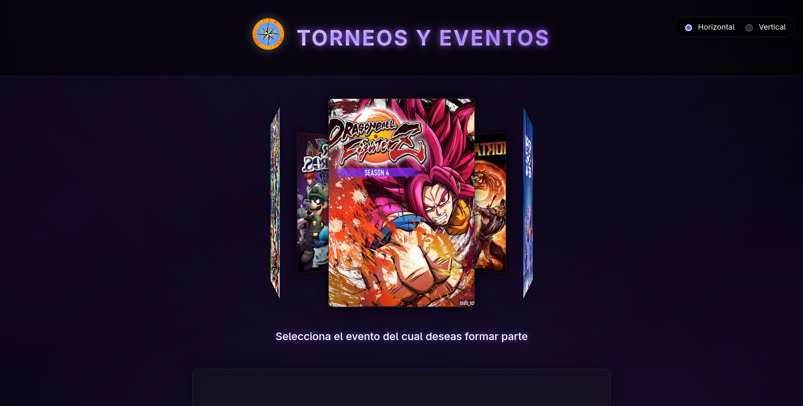

# Torneos UDO - EICA

Aplicación web interactiva diseñada para la visualización y difusión de los torneos de e-sports y eventos culturales organizados en la EICA - UDO Nueva Esparta.



## 🎮 Descripción

Este proyecto sirve como cartelera digital para la semana de torneos. Los usuarios pueden navegar a través de una interfaz moderna con un carrusel 3D para explorar los diferentes torneos disponibles, ver detalles específicos como, fechas, horarios, ubicación (Edificio/Salón), premios y acceder directamente a los canales de inscripción.

## 🏆 Torneos y Eventos

La plataforma cubre una variedad de competiciones para la semana del 26 al 30 de Enero de 2026:
- **Mortal Kombat 2011** (Lunes)
- **Project M** (Martes)
- **Super Smash Flash 2** (Miércoles)
- **Dragon Ball FighterZ** (Jueves)
- **K-Pop Demon Hunter** (Viernes)

## ✨ Características

- **Diseño Interactivo:** Carrusel 3D fluido para la selección de juegos.
- **Información Detallada:** Modales informativos con cronogramas, ubicación exacta y tabla de premios.
- **Conectividad:** Enlaces directos a grupos de WhatsApp y códigos QR para cada torneo.
- **Animaciones:** Transiciones suaves y efectos visuales modernos.

## 🛠️ Tecnologías

- **React** + **Vite**
- **TypeScript**
- **Framer Motion**
- **Lucide React**

## 🚀 Ejecución

1. Instalar dependencias:
   ```bash
   npm install
   ```
2. Iniciar servidor de desarrollo:
   ```bash
   npm run dev
   ```
